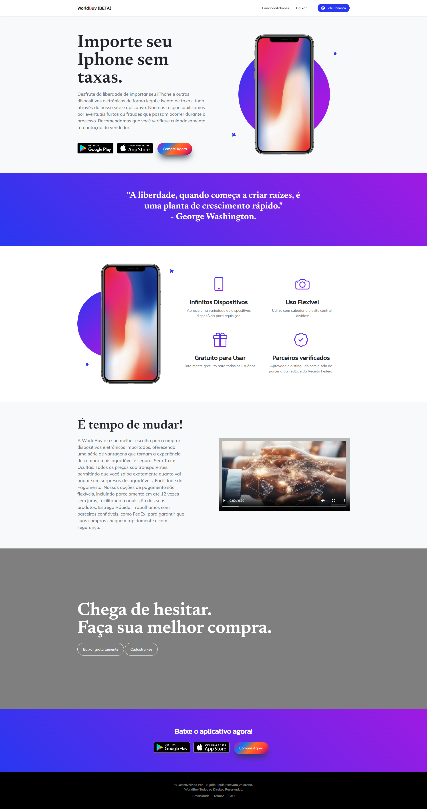
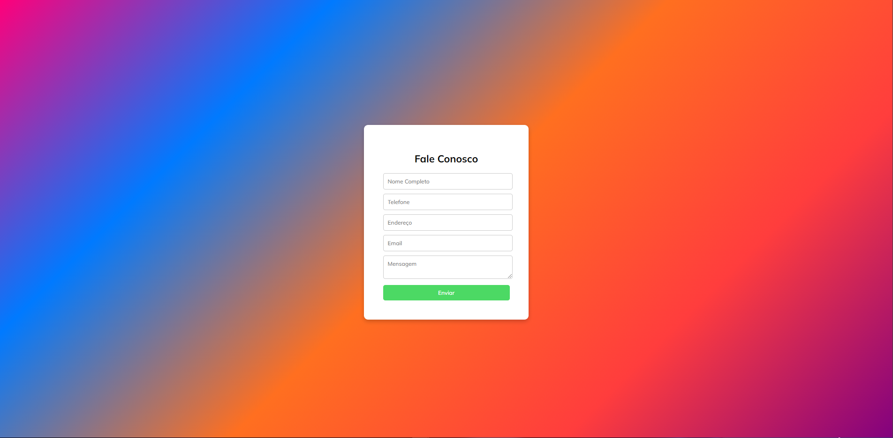

<h1 align="center" style="font-weight: bold;">WorldBuy 🛒</h1>

<p align="center">
 <a href="#technologies">Tecnologias/Technologies</a> • 
 <a href="#started">Começando/Getting Started</a> • 
  <a href="#colab">Colaboradores/Collaborators</a> •
 <a href="#contribute">Contribua/Contribute</a>
</p>

<p align="center">
    <b>The objective of this project was to explore various PHP functions while developing a website dedicated to this concept. The site is named "WorldBuy," where users can conveniently purchase products and import them to Brazil without incurring any additional taxes. This platform aims to provide a seamless shopping experience, enabling users to access global markets effortlessly. </b>
</p>

<p align="center">
     <a href="https://github.com/JoaoEstevam01/WorldBuy">📱 Visite o projeto/Visit this Project</a>
</p>

<h2 id="layout">🎨 Layout</h2>

<p align="center">
    
    
</p>

<h2 id="technologies">💻 Tecnologias/Technologies</h2>
- PHP<br>
- HTML<br>
- CSS<br>
- JAVASCRIPT<br>
- BOOTSTRAP<br>

<h2 id="started">🚀 Começando/Getting started</h2>

<h3>Clonando/Cloning</h3>

Como clonar o meu projeto/How to clone my project:

```bash
git clone https://github.com/JoaoEstevam01/WorldBuy
```

<h2 id="colab">🤝 Colaboradores/Collaborators</h2>

Apenas eu/It's just me. 🤠👍

<table>
  <tr>
    <td align="center">
      <a href="https://github.com/JoaoEstevam01">
        <br>
        <sub>
          <b>João Estevam</b>
        </sub>
      </a>
    </td>
  </tr>
</table>

<h2 id="contribute">📫 Contribua/Contribute</h2>

Caso deseje me ajudar neste projeto com mais ideias, modificações, melhorias e se tornar um colaborador/If you'd like to assist me with this project by contributing ideas, modifications, improvements, and becoming a collaborator:

Email: joaoestevam.1204@gmail.com
